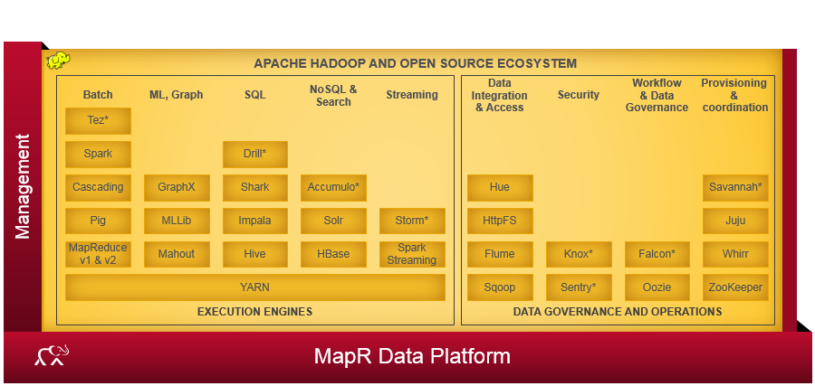

## Agenda

* Apache Drill Overview
* MapR Sandbox for Drill
* Demo: Querying different data formats
* Demo: Querying across different data sources
* Next Steps

## Apache Drill Overview

* Low-latency [^1] SQL query engine on Hadoop and NoSQL.
* Part of the MapR offering:


[^1]: This is MapR marketing speech, I haven't tested the low-latency aspect :)

## Apache Drill Overview: Key Features

* **Generic:** Drill supports multitude of data formats and data sources through a single interface: *ANSI SQL*.
* **Flexible:** To Drill it doesn't matter whether you're querying a DB or highly nested data formats (JSON, Parquet), it all works just like querying like SQL columns.
* **Schema-less:** There is no need to provide a schema or type specification for data before starting queries, Drill discovers these *automagically*.
* **Extensible**: Different data sources, such as e.g. MapR-FS, MapR-DB, Hive, JSON etc. are handled through various different *storage plugins*. New storage plugins can be added.[^2]
* **Metadata:** Drill uses a de-centralized metadata repository. The metadata is derived from storage plugins.

[^2]: Other parts of Drill (query optimization, functions) are open for modification, too.

## MapR Sandbox for Drill

* Pre-packaged VM (VMWare or Virtualbox).
* Download it here: <https://www.mapr.com/products/mapr-sandbox-hadoop/download-sandbox-drill>
* Comes pre-configured with three data sources (storage plugins): MapR-FS, MapR-DB, Hive
* Once it's up and running, there is a neat Web UI: <http://192.168.33.2:8047/>
* List and configure storage plugins.

## Demo: Querying Different Formats

* Here I'm using some of the sample data sets that come with Drill.
* Example 1: Query through Hive to get sales data.
* Example 2: Query JSON transaction log files.
* The second example is complicated by the fact that the JSON files are spread across different sub-directories.
* This shows off three key Drill features: Generic, schema-less and flexible. 

## Demo: Example 1 -- Hive

* Doing this through R Studio to also emulate what a BI tool would do.
* Uses JDBC connection.
* Task: Create a histogram of sales figures.

## Demo: Example 2 -- JSON

* $\rightarrow$ Look at directory tree.
* $\rightarrow$ Look at logs excerpt.
* Task: Find out which mobile devices customers had used most frequently.
* Again using R Studio as my BI tool for processing.
* In the real world: Do as much pre-processing as possible through highly optimized SQL queries.
* For this purpose, Drill has loads of aggregation functions already build in.

## Demo: Querying Across Different Data Sources 

* Task: Get total sales per membership type from Hive and MapR-DB via the customer id.

```{r echo=FALSE, fig.width=2, fig.height=2}
library(jpeg)
library(grid)
img <- readJPEG("query_across.jpg")
grid.raster(img)
```

## Next Steps

* Use larger, real-world data set, data sources and use cases.
* Benchmarking for various different use cases.
* See how well JDBC works in the real world. Do existing queries work out of the box or is there change needed?